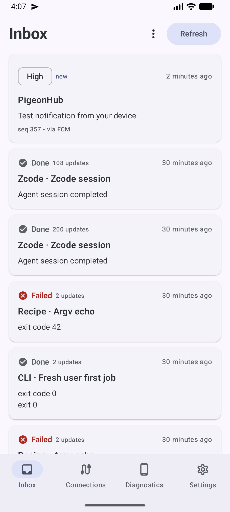
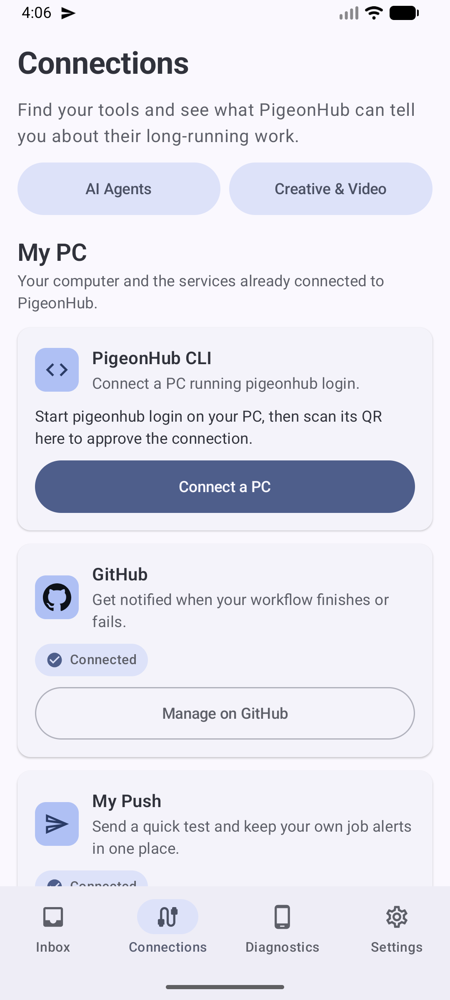
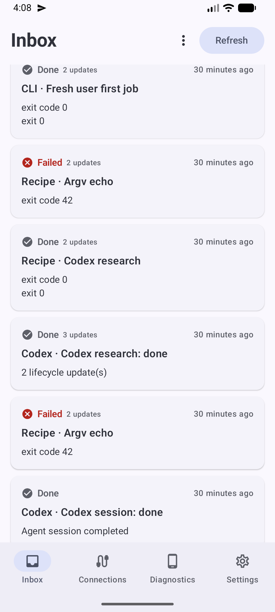
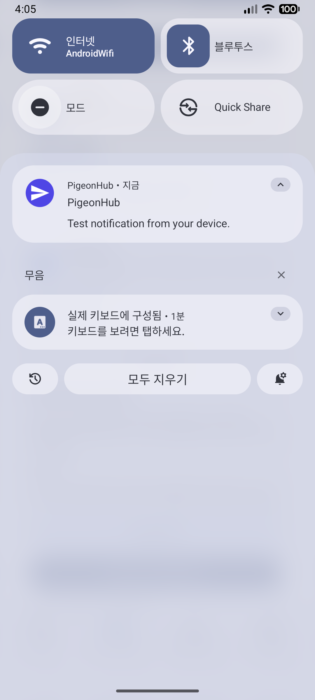
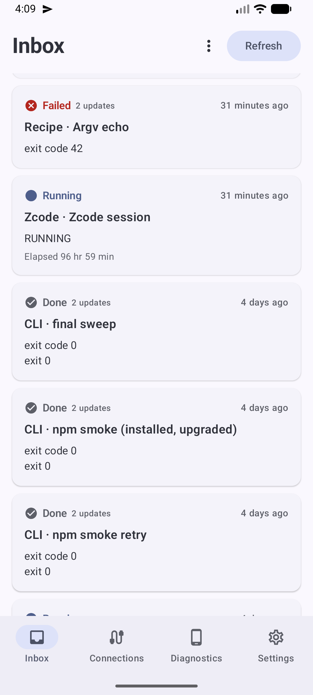
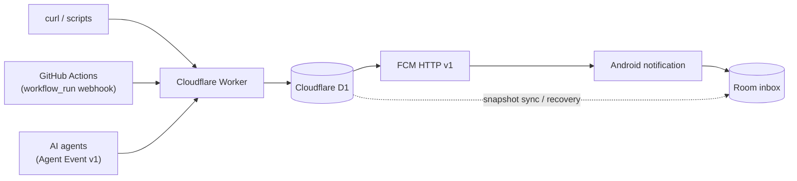

# PigeonHub

**Developer & AI-agent push inbox for Android.**

Send a `curl`, finish a GitHub Actions workflow, or emit a structured
AI-agent event — PigeonHub turns it into a durable Android notification
and inbox entry.

## PigeonHub in action

<p align="center">
  
  
  
</p>
<p align="center">
  
  
</p>

*Inbox with job state, delivery metadata (`seq`, `via FCM`) and coalesced
agent sessions · Connections (GitHub App, AI agents, PC) · Android
notification shade.*

## Why PigeonHub?

Long work finishes (or gets stuck) while you are away:

- CI/CD pipelines and builds end in success or failure
- AI coding agents complete tasks — or block waiting on your approval
- crawlers, renders, and training runs run for hours

PigeonHub gives all of those systems **one HTTP destination**, and gives
the developer **one Android inbox**: durable, ordered, and quiet until it
matters.

## Architecture



Production backend: **Cloudflare Workers + D1 + FCM** (all on the free
plan — OAuth2 access tokens for FCM are minted on-device in the Worker
via RS256 JWT, cached until expiry). The `server/` directory is only a
local development/reference sender. A scheduled maintenance job performs
retention cleanup and bounded delivery recovery.

## Core features

- **Private installation bootstrap** — the app generates its own
  management secret + write token (Keystore-encrypted, persisted before
  any network request) and registers through a single-use invite code;
  every installation gets a private publish endpoint
- **Durable-before-push** — every message is persisted to D1 (`pending`)
  before FCM is attempted; push is a transport, never the source of truth
- **Idempotency** — `Idempotency-Key` (or message id) replays converge on
  one stored row; duplicates are absorbed client-side too
- **Per-channel sequence** — strict `(channel_id, seq)` ordering across
  concurrent senders
- **Snapshot sync & bounded recovery** — the app pages history from D1
  (cursor-based) and can recover missed deliveries after being offline
- **Server-side progress coalescing** — chatty `PROGRESS` events for the
  same job collapse into one card with an update counter
- **Retention maintenance** — scheduled cleanup + bounded redelivery
- **FCM token refresh** — tokens rotate transparently; stale tokens are
  isolated without losing the channel
- **GitHub Actions integration** — GitHub App + `workflow_run` webhook,
  HMAC-verified, fanned out to every device of the installation owner
- **AI Agent Event v1** — structured, validated agent lifecycle events
- **Windows CLI + agent integrations** — `pigeonhub` wraps any long-running
  command (or recipe) and reports its lifecycle; native hooks for Codex,
  Claude, Grok, and ZCode; one-command Setup Center onboarding
- **Android** — Kotlin + Jetpack Compose + Material 3, Room inbox, two
  notification channels (normal / high), KO/EN localization

## Quick start

### 1. Pair a device

Install the Android app, generate an invite, and bootstrap — or open the
in-app **My Push** card and copy your personal cURL. Every installation
owns a private endpoint of the form:

```text
https://<worker>/v1/channels/<channel_id>/messages
```

### 2. Send a push

```bash
curl -X POST "$PIGEONHUB_ENDPOINT" \
  -H "Authorization: Bearer $PIGEONHUB_WRITE_TOKEN" \
  -H "Idempotency-Key: deploy-001" \
  -H "Content-Type: application/json" \
  -d '{
    "title": "Deploy complete",
    "message": "Production rollout finished successfully.",
    "priority": "normal",
    "url": "https://github.com/example/project/actions"
  }'
```

`title` and `message` are required; `priority` is `normal|high`;
`url` is optional and **https-only**. Never commit real credentials.

### 3. Track a long-running job (Windows CLI)

```powershell
pigeonhub login                       # pair: scan the QR with the app
pigeonhub run --name "Crawler" -- python crawler.py
```

The job appears on your phone (`RUNNING` → `PROGRESS` → `DONE`), the child
process keeps its own stdout/exit code, and inside the job you can report
fine-grained state:

```bash
pigeonhub progress 42 100
pigeonhub needs-action "Please choose the output folder"
```

Frequent commands can be saved as **recipes** and re-run with one line.
`pigeonhub onboard` opens a local Setup Center in the browser (loopback
only, ephemeral) that walks through phone pairing and tool connections —
including zero-command Codex/ZCode integration.

## AI Agent Event v1

Agents attach a validated `agent_event` to a publish call:

```json
{
  "title": "Agent needs approval",
  "message": "Production deployment is waiting for confirmation.",
  "priority": "high",
  "agent_event": {
    "eventId": "deploy-prod-7-attention",
    "eventType": "agent.attention_required",
    "attentionReason": "approval",
    "provider": "zcode",
    "runId": "deploy-prod-7",
    "summary": "Production deploy is waiting for confirmation."
  }
}
```

| Field | Value |
| --- | --- |
| `eventId` | required — your id for this event (1–128 chars) |
| `eventType` | `agent.started` · `agent.finished` · `agent.blocked` · `agent.attention_required` · `agent.attention_resolved` |
| `attentionReason` | required for `agent.attention_required` — one of `input` · `approval` · `permission` · `clarification` · `other`; also required for `agent.blocked`, then one of `rate_limit` · `quota` · `auth` · `environment` · `tool_failure` · `other` |

Events are validated server-side (unknown types/reasons are rejected
before storage), and attention-worthy events map to Android's high
priority channel. PigeonHub does not natively embed specific AI
frameworks — anything that can POST JSON is an agent client, and the
`pigeonhub setup <agent>` command installs vendor-native hooks for the
agents it knows.

## GitHub Actions integration

```text
GitHub Actions workflow completes
        ↓
workflow_run.completed  (webhook, HMAC-SHA-256 verified)
        ↓
PigeonHub Worker  →  D1 durable message
        ↓
FCM fan-out to every device of the installation owner
        ↓
Android notification + inbox entry
```

Install the GitHub App from the app's Connections tab; per-run messages
include conclusion, branch, and a link to the run. Evidence:
[owner-scoped fan-out](docs/reports/mvp-003b-owner-scoped-fanout.md),
[clean-AVD E2E verification](docs/reports/mvp-003b-clean-avd-e2e-verification.md),
[root-cause audit](docs/reports/mvp-003b-root-cause-audit.md).

## Reliability model

Every publish flows through the same pipeline:

```text
1. Validate payload (reject before any side effect)
2. Check idempotency (replay-safe)
3. Enforce quota
4. Insert into D1 as pending   ← durable before any push
5. Attempt FCM (OAuth2 token cached)
6. Persist delivery result
7. Android recovers history through snapshot sync
```

**FCM is a delivery transport. D1 is the durable source of truth.**

Message state machine: `pending → fcm_accepted | failed`. A 200 response
means the row is durable even when FCM delivery failed; the Android app
reconciles through cursor-based sync, and a scheduled maintenance pass
performs retention cleanup and bounded redelivery.

## Repository structure

| Path | What it is |
| --- | --- |
| `worker/src/` | Production transport: routes, D1 access, FCM client + GCP auth, GitHub webhook/connection, agent events, job coalescing, maintenance |
| `android/` | Android app (Kotlin, Compose, Material 3, Room inbox, FCM) |
| `pigeonhub/` | Windows CLI: pairing, job wrapper, recipes, agent setup, Setup Center onboarding, Codex auto-connect |
| `server/` | Local development/reference sender (Fastify + firebase-admin), kept for regression |
| `packaging/windows/` | PyInstaller one-file build + Inno Setup installer |
| `docs/` | Setup guides, payload contract, and per-milestone evidence reports |

## Build

### Worker

```bash
cd worker
npm install
npm run typecheck
```

Deploy secrets (never committed): `FIREBASE_CLIENT_EMAIL`,
`FIREBASE_PRIVATE_KEY`. See `worker/wrangler.jsonc`.

### Android

```bash
cd android
./gradlew :app:assembleDebug
adb install -r app/build/outputs/apk/debug/app-debug.apk
```

No Firebase config is required to build. `applicationId` is fixed:
`com.pigeonhub.app`.

### Windows CLI

```powershell
python -m pip install -e .            # from source (Python ≥ 3.10)
powershell -File packaging\windows\build.ps1   # exe + installer artifacts
```

## Security

- No Firebase service-account JSON, no `.env`, no FCM tokens, and no
  invite codes are committed
- The Android app never holds Firebase admin credentials; registration
  credentials are Keystore-encrypted and generated on-device
- Channel write tokens are private per installation; the app masks the
  FCM token and offers explicit copy actions only
- GitHub webhooks are HMAC-SHA-256 signature-verified
  (`X-Hub-Signature-256`)
- AI-agent events carry bounded, allow-listed metadata only — no prompts,
  transcripts, or file contents cross the boundary
- The Setup Center binds to `127.0.0.1` on a random port, is gated by a
  session token, and exposes a fixed action allowlist (no command
  execution)

## Status

- The production path — REST sender / GitHub webhook / AI-agent event →
  Cloudflare Worker → D1 → FCM → Android notification + inbox — is
  **implemented**, and end-to-end delivery has been verified on the
  Android emulator, including owner-scoped multi-device fan-out,
  stale-token isolation, and webhook redelivery idempotency
- A final physical-device verification pass (real Galaxy:
  pairing-state UX, reboot persistence, desktop-app completion push)
  remains the last open item

Detailed per-milestone evidence lives in [`docs/reports/`](docs/reports/).
